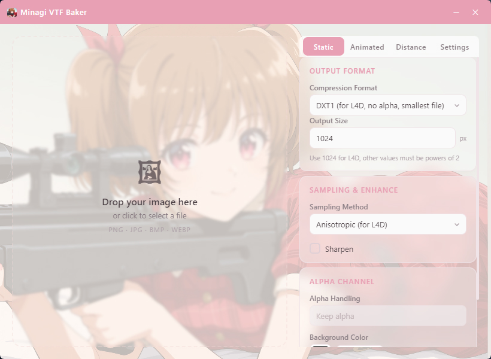
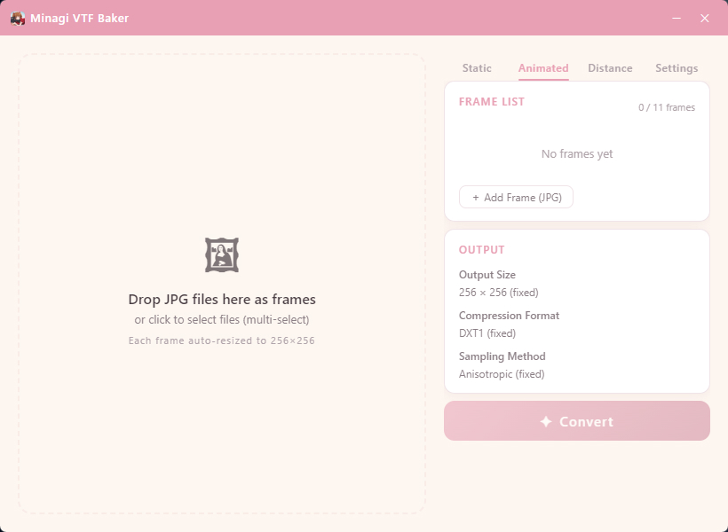
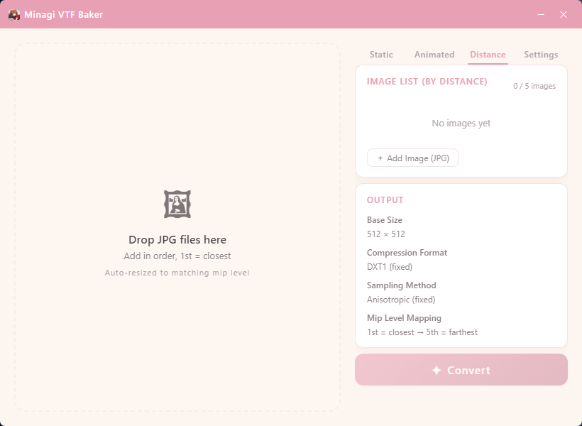
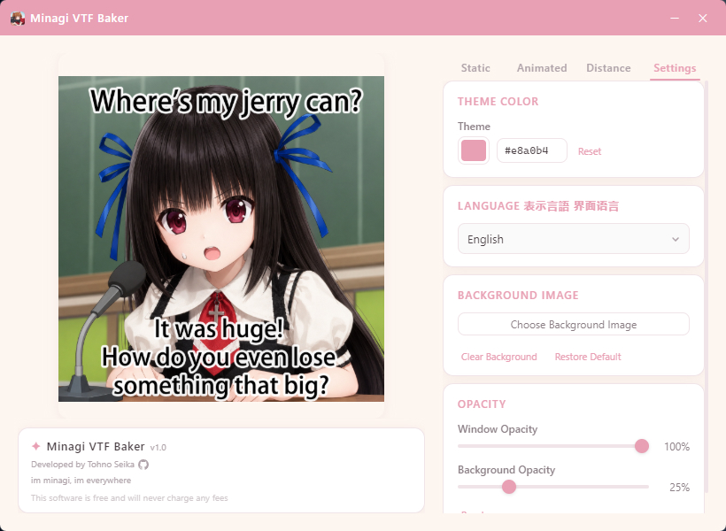

# Minagi VTF Baker ✦

> [中文](README.zh.md) · [日本語](README.ja.md)

Turn any image into a **Left 4 Dead 2 spray** — simple, beautiful, fast.

A Windows desktop tool that converts PNG / JPG / BMP / WEBP images into **L4D2-compatible VTF spray files**.  
Supports static, animated, and distance-blended sprays.  
Built with Tauri — lightweight and elegant.

---

## ✨ Features

- 🖼️ **Three Spray Modes** — Static VTF / Animated Spray / Distance-Blended Spray
- 🎨 **DXT Compression** — DXT1 / DXT5 / RGBA8888 with alpha channel support
- 🔄 **Sampling Methods** — Anisotropic / Bilinear / Nearest Neighbor
- ✏️ **Sharpening** — Optional unsharp mask filter
- 🌐 **Multi-language UI** — 简体中文 · 日本語 · English
- 🎨 **Custom Theme** — Freely change the accent color
- 🖼️ **Custom Background** — Set your own background image
- 🪟 **Window Opacity** — Independent control for UI and background opacity
- 🚀 **Performance** — ~6MB installer, instant startup

---

## 📖 Usage

| Action | Description |
|:---|:---|
| 🖱️ **Drop an image** | Drag & drop onto the left panel, or click to select a file |
| 🔧 **Set parameters** | Choose compression format, output size, sampling method, etc. |
| ✨ **Convert** | Click "Convert" — the `.vtf` file is saved to the source directory |
| 🎬 **Animated spray** | Switch to the "Animated" tab, add JPG frames, and build an animated spray |
| 🌄 **Distance spray** | Switch to the "Distance" tab, add layers by distance, and build a distance-blended spray |
| ⚙️ **Customize** | Go to Settings to change theme color, background image, and opacity |

---

## 🎮 How to Use the VTF File

### ⚠️ Important Notes
For L4D2 static spray VTF generation:
- **Output Format** must be set to **DXT1** and **1024**
- **Sampling** must be set to **Anisotropic**
- The **Sharpening** option has no observed effect, but feel free to test it yourself

### 📍 File Location
After conversion, the VTF file is automatically saved in the **same folder as the source image**.
File naming rules:
- `static_minagi.vtf` (Static spray)
- `animated_minagi.vtf` (Animated spray)
- `distance_minagi.vtf` (Distance spray)

### 🎯 In-Game Usage
Open Left 4 Dead 2, go to **Options** → **Multiplayer** → **Import custom spray**. Select your VTF file, click **Done**, and the new spray will appear starting from the next map.

---

## 🎥 Introduction Video

▶️ [Watch on Bilibili](https://www.bilibili.com/video/BV1Hv7564ERA) (Chinese audio only)

---

## 🖼 Screenshots

---

## 📦 Download

Download the latest installer from the [Releases](https://github.com/TohnoSeika/minagi-vtf-baker/releases) page.

> 💡 Current version **v1.0**, ~6MB installer. A portable (no-install) version is also available.

---

## 📋 Changelog

### v1.0
- 🎉 Initial release
- 🖼️ Static / Animated / Distance spray conversion
- 🌐 Chinese / Japanese / English UI
- 🎨 Custom theme color, background image, and opacity
- 🪟 Window transparency control

---

## 🤖 AI Assistance

Part of this project's code and UI design was created with AI assistance.

---

## 📜 License

This software is **freeware**, all rights reserved.  
See [LICENSE](./LICENSE) (English) · [LICENSE.zh](./LICENSE.zh) · [LICENSE.ja](./LICENSE.ja) for details.

---

> This software is free and will never charge any fees.  
> Developed by Tohno Seika
