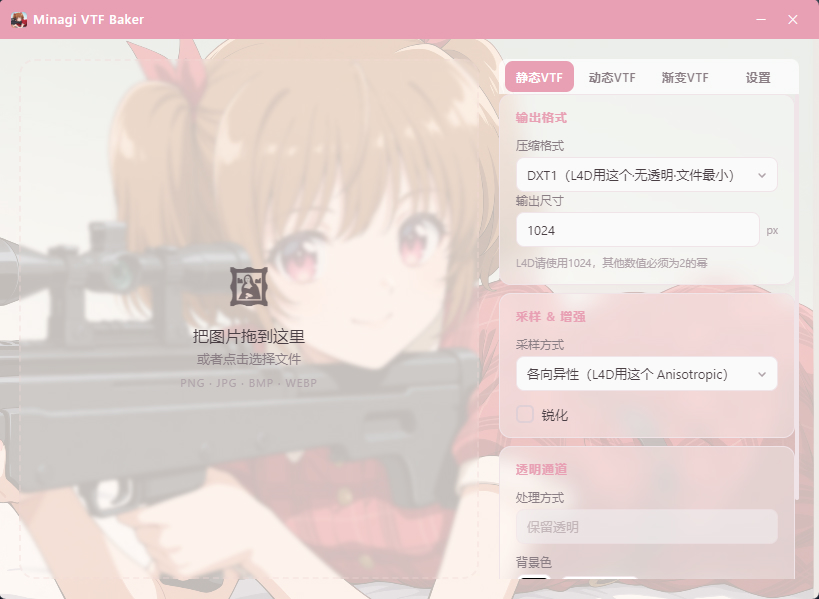
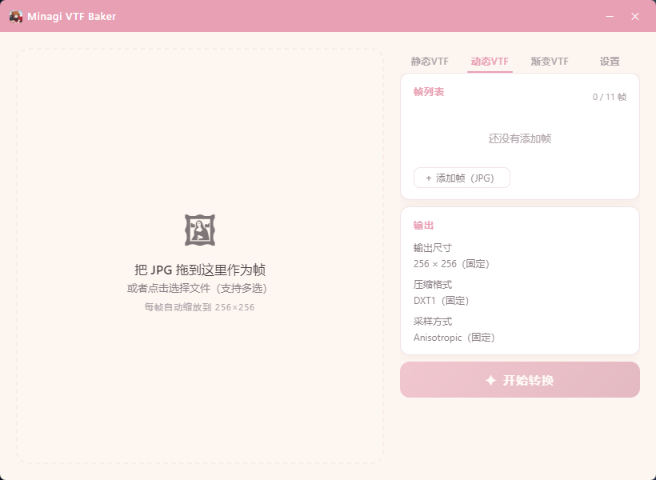
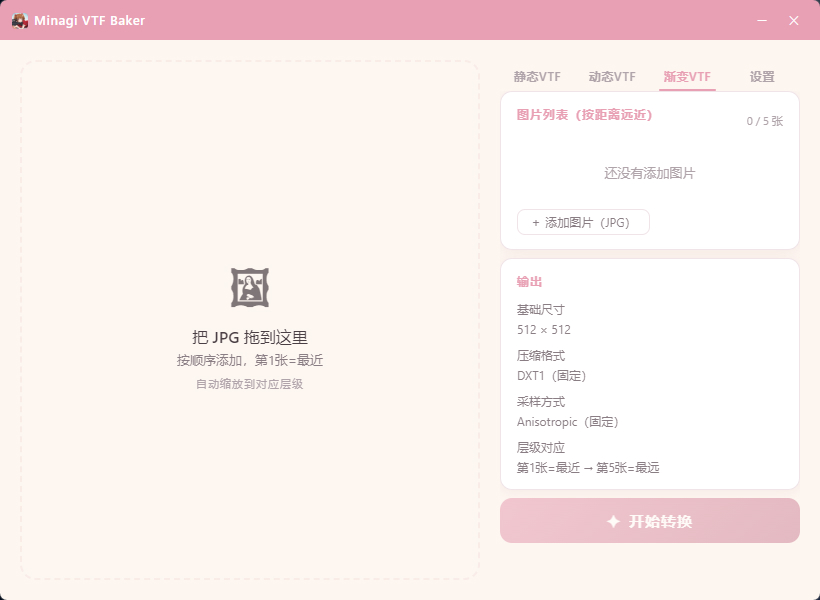
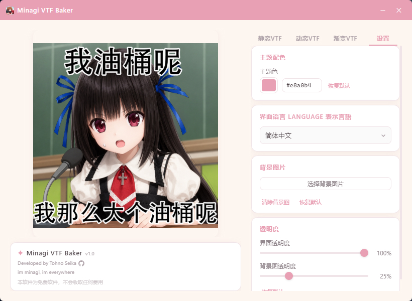

# Minagi VTF Baker ✦

> [English](README.md) · [日本語](README.ja.md)

把普通图片变成 **Left 4 Dead 2 的喷漆**——简单、漂亮、又快。

一个 Windows 桌面工具，将 PNG / JPG / BMP / WEBP 图片一键转换为 **L4D2 兼容的 VTF 喷漆文件**。  
支持静态喷漆、动态喷漆、远近渐变喷漆三种模式。  
基于 Tauri 构建，轻量、优雅。

---

## ✨ 特性

- 🖼️ **三种喷漆模式** —— 静态 VTF / 动态喷漆 / 远近渐变喷漆
- 🎨 **DXT 压缩** —— DXT1 / DXT5 / RGBA8888 可选，支持透明通道
- 🔄 **采样方式** —— 各向异性 / 双线性 / 最近邻
- ✏️ **锐化增强** —— 可选锐化滤镜
- 🌐 **多语言界面** —— 简体中文 / 日本語 / English
- 🎨 **主题配色** —— 自由更换主题色
- 🖼️ **自定义背景** —— 支持自定义背景图片
- 🪟 **自定义窗口透明度** —— 界面和背景图透明度独立调节
- 🚀 **性能** —— 安装包约 6MB，即时启动

---

## 📖 使用方法

| 操作 | 说明 |
|:---|:---|
| 🖱️ **拖入图片** | 把图片拖到左侧拖放区，或点击选择文件 |
| 🔧 **设置参数** | 选择压缩格式、输出尺寸、采样方式等 |
| ✨ **开始转换** | 点击「开始转换」，自动生成 `.vtf` 文件到原目录 |
| 🎬 **动态喷漆** | 切换到「动态VTF」，添加 JPG 帧序列，合成动画喷漆 |
| 🌄 **渐变喷漆** | 切换到「渐变VTF」，按距离远近添加图层，生成远近喷漆 |
| ⚙️ **个性化** | 在设置页自定义主题色、背景图、透明度 |

---

## 🎮 VTF 使用方法

### ⚠️ 注意事项
用于 L4D2 内使用的静态喷漆 VTF 生成：
- **输出格式**必须选择 **DXT1** 和 **1024**
- **采样&增强**必须选择 **Anisotropic**
- **锐化**选项实测没有影响，但你可以自行测试

### 📍 生成的文件在哪
转换完成后，VTF 文件会自动保存在**原图片所在的文件夹**里。
文件名命名规则为：
- `static_minagi.vtf`（静态喷漆）
- `animated_minagi.vtf`（动态喷漆）
- `distance_minagi.vtf`（远近渐变喷漆）

### 🎯 如何在游戏内使用
打开 Left 4 Dead 2 游戏，进入「选项」，进入「多人联机」，选择「导入喷漆图案」，导入后点击「完成」即可在下一个关卡中使用新的喷漆。

---

## 🖼 截图

---

## 📦 下载

从 [Releases](https://github.com/TohnoSeika/minagi-vtf-baker/releases) 页面下载最新版本的安装包即可。

> 💡 当前版本 **v1.0**，安装包约 6MB。另有绿色便携版（无需安装，解压即用）。

---

## 📋 更新记录

### v1.0
- 🎉 初版发布
- 🖼️ 支持静态 / 动态 / 远近渐变三种喷漆转换
- 🌐 中/日/英三语界面
- 🎨 主题色、背景图、透明度自定义
- 🪟 窗口透明度控制

---

## 🤖 AI 辅助声明

本项目的部分代码及界面设计借助 AI 辅助完成。

---

## 📜 许可证

本项目为 **免费软件**，保留所有权利。  
详情请参见 [LICENSE](./LICENSE)（英文）· [LICENSE.zh](./LICENSE.zh)（中文）· [LICENSE.ja](./LICENSE.ja)（日文）文件。

---

> 本软件为免费软件，不会收取任何费用。  
> Developed by Tohno Seika
